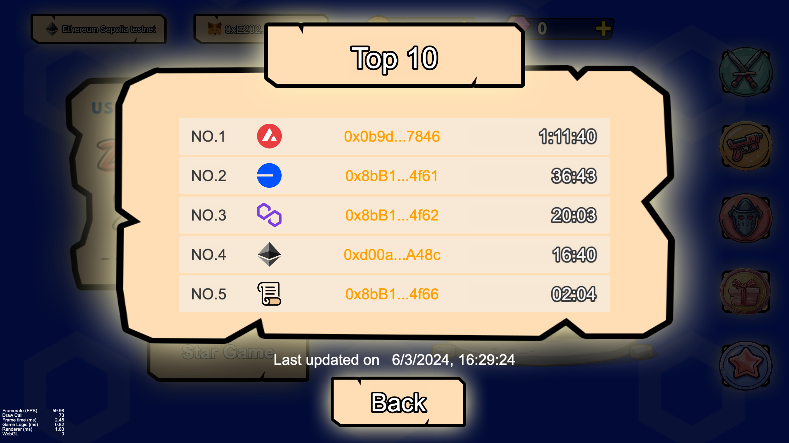

# Gaming: zkVampireSurvivors

## What is zkVampireSurvivors
zkVampireSurvivors is a time survival game with minimalist gameplay and roguelite elements. It uses zero-knowledge proof technology to ensure the security of game results. It uses Chainlink CCIP technology to create a full-chain leaderboard that can display multi-chain data. It uses VRF 2.5 to create a lottery mechanism that takes into account both randomness and security.

Using the introduction of the original Vampire Survivors game to explain the game values ​​of zkVampireSurvivors: Monsters are everywhere, and you are nowhere to escape. All you can do is survive as long as possible until death inevitably ends your struggle. Collect gold in each run to buy upgrades and help the next survivor.

[Click to play zkVampireSurvivors](https://catkevin.github.io/zkVampireSurvivors/)

Tips: Please use chrome browser to open.

## Inspiration
I was previously addicted to the popular game 《Vampire Survivors》.We can play it on steam.This game is very addictive and one game can take at least half an hour, or even several hours.We can also check the player's game time on the game platform.
This gave me an inspiration: Can we also make a ranking list of players’ gaming time like this?
However, there are many different blockchains now, such as Ethereum, Avalanche, Polygon, etc.On each blockchain, the user groups may be very different and their usage habits may also be different. For example, A has been interacting on Avalanche, but B has been interacting on Polygon, even if they are using the same application or game.
During this process, the data of the two blockchains are not interoperable！
Therefore, I decided to implement a full-chain leaderboard through Chainlink CCIP, so that players from different blockchains can compete and play together.

## How to play

### 1、Loading Scene
- Wait for the progress bar to end, select the network and wallet you want to interact with, and then start the game
  

### 2、Home Scene
- On the homepage, you can see various game data, such as the number of gold coins and diamonds, network type, wallet address, etc., as well as game characters and weapons, and of course the scrolling background and LOGO I drew specifically for Block Magic.
- The five buttons on the right have different functions: Home, Weapons, Characters, Lottery, and Full Chain Rankings.
- Click the Start Game button, you need to pay one dollar for the gas token, then wait for a moment and enter the game after the transaction is completed.
- How is the gas token of one dollar calculated? I will explain it in detail later.

#### 2.1 Weapon Page
- Players can buy and upgrade weapons, but it is usually not easy to get gold coins and diamonds (lottery is one of the easiest ways to get high-level weapons)

#### 2.2 Characters/Skins Page

- Players can buy and upgrade characters. I have drawn many characters of this type, but due to time constraints, I only show four characters here.

#### 2.3 Lottery Page

- Players need to pay four dollars to participate in the lottery, and can draw gold coins, diamonds and advanced weapons.
- Chainlink VRF v2.5 is used here to implement the random extraction function, ensuring the fairness and randomness of the lottery.
- If you want to experience the Howitzer and Gatling as soon as possible, please come and participate in our lucky draw!

#### 2.4 Full chain ranking page
- Here you can see the player ranking data of all blockchains, and you can see the blockchain logo and player time of each project.
- At the bottom you can view the update time of the current chain's ranking.
- This ranking list can be scrolled up and down, and currently stores the top ten data of all blockchain rankings.

### 3、Game Scene
- After entering the game, players can use the "W", "S", "A" and "D" keys on the computer keyboard to control the character's movement up, down, left and right.（You can see this keyboard button in the lower right corner of the page）
- By controlling the player to avoid monsters, use weapons to kill monsters, then extract experience points, and obtain more interesting skills through upgrades.

- You can click on the avatar in the upper left corner to view the attributes of the current character.
- The top of the screen shows the character's level and skills.
- There is a bombing button and a magnet button on the right, which can bomb monsters and absorb experience points globally respectively. But it can only be used once per game!
- The rest is up to you to experience! I designed a very interesting algorithm to control the generation of monsters, so that players are always in a state of tension and immersed in the game.
- This is why I developed the game! I hope the game can bring happiness to everyone, not boring airdrops.
  

- On the game settlement page, you need to click the Submit button to spread this valuable game data to various blockchains through Chainlink CCIP, so that players around the world can see your outstanding performance!

## How I build it
### 1、logo
I use photoshop to draw the game logo and most of the game assets

### 2、Chainlink
Without a doubt, Chinklink is the one I use most frequently in the entire project. It allows me to build a scenario that I had never thought of before - the full chain leaderboard.

### 2.1 Chainlink CCIP
Through Chainlink CCIP, I developed the function of the whole chain ranking list.
Due to security issues, the data update time of each blockchain is delayed, so I used a specific algorithm to avoid the impact of time.

[Chainlink CCIP code is here](https://github.com/CatKevin/zkVampireSurvivors/blob/main/contracts/ZKGameClient.sol#L378-L514)

### 2.2 Chainlink VRF v2.5
I used Chainlink VRF v2.5 to generate random numbers directly. This function can be easily implemented through the official documentation! When generating random numbers, I drew prizes on the chain and got the lottery results through the read function in the game.

[Chainlink VRF v2.5 code is here](https://github.com/CatKevin/zkVampireSurvivors/blob/main/contracts/ZKGameClient.sol#L292-L349)

### 2.3 Chainlink Data Feeds
In DeFi applications, Chainlink Data Feeds are often used to get asset prices. In games, you can also use Chainlink Data Feeds to get the price of gas tokens, and then calculate the number of tokens per dollar. This way you can calculate how many gas tokens you need to pay. This is very useful in game stores because the prices of game assets are usually fixed prices! !
There are multiple scenarios in the game where fixed amount payments (U-based payments) are used (this is different from the NFT market which uses currency-based payments).

[Chainlink Data Feeds code is here](https://github.com/CatKevin/zkVampireSurvivors/blob/main/contracts/ZKGameClient.sol#L197-L203)

## 3  Avalanche
I deployed the game's smart contract on Avalanche. The experience was very good and the transaction speed was very fast!
I tried using Ava Cloud’s free tier during testing, and it was easy to get started with development based on the documentation.

## 4  Polygon
Since Chinklink CCIP is currently only supported on the Polygon Amoy testnet, I decided to deploy the game on the Polygon Amoy Testnet.

## Thank you for reading
Thank you for your patience in reading this document. It is very long and took you a lot of time! Thank you very much!
Of course, you are welcome to try my game! Feel the joy of roguelike game!

[Click to play zkVampireSurvivors](https://catkevin.github.io/zkVampireSurvivors/)